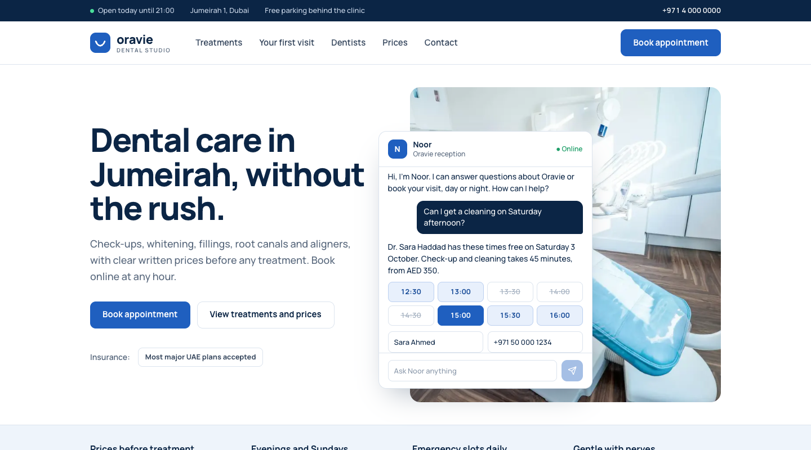
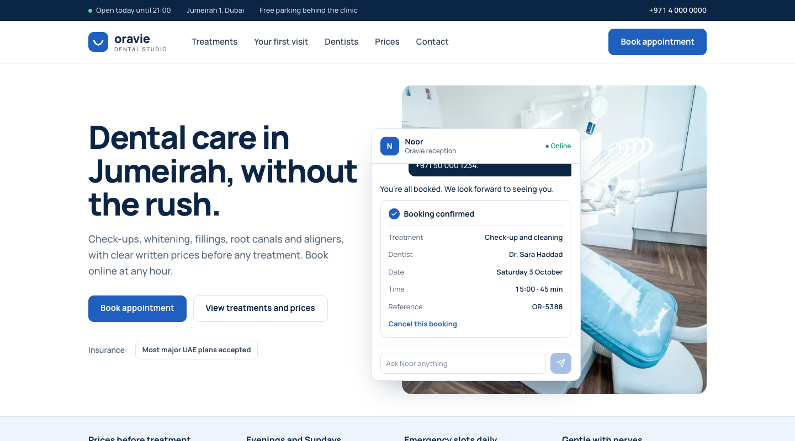
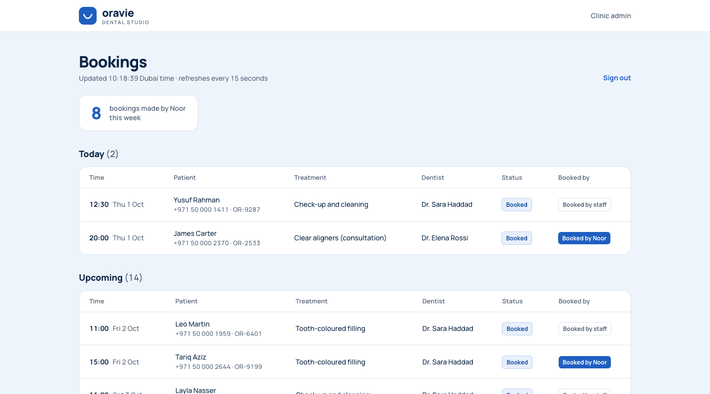
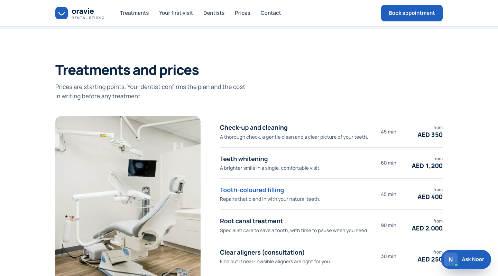

# Oravie Dental Studio

A clinic website with an AI receptionist built in. Noor answers patients' questions from
the clinic's own information, checks live availability, books real appointments and
cancels them, and every booking appears in the clinic's admin page.

> Oravie is a concept brand created for a portfolio project. The clinic, Noor, the
> dentists, the phone number and the booking references are fictional, and Noor does not
> give medical advice.



## What Noor does

- **Answers from the clinic's own information.** Treatments, prices, dentists, hours,
  insurance and policies live in one file, [`knowledge.md`](knowledge.md). Answers about
  them carry a small source tag, such as "Source: Oravie price list".
- **Offers real times.** Free slots come from each dentist's working days, clinic hours,
  treatment length and existing bookings, and show as a grid of tappable times with
  taken ones struck through.
- **Books and cancels.** Picking a time asks for a name and phone, then returns a
  confirmation card with a reference. Cancelling needs the reference and the phone
  number it was booked with.
- **Handles emergencies.** Tooth pain brings up a card with the clinic phone, the next
  free same-day times, and when to go to a hospital instead.
- **Knows its limits.** No medical advice, no promises about insurance cover, and a
  clear message with the clinic phone if she can't help.

| Booking confirmed | Clinic admin |
| --- | --- |
|  |  |

## The website

One page: an open-today status worked out from the clinic's real hours, treatments with
"from" prices (each row opens Noor with that treatment), what happens at a first visit,
the dentists with each one's next free time, an FAQ and opening hours. Noor sits in the
hero and follows the visitor as a floating button, opening full screen on phones.



## Built to be safe to share

- The database refuses overlapping bookings for a dentist, so two patients can't take
  the same time even if they confirm at the same moment.
- A wrong phone number gets the same answer as a missing booking, so references can't
  be guessed at.
- Each visitor is limited to 20 messages per 10 minutes, messages to 500 characters and
  replies to 400 tokens. That limit is counted per server instance, so a spending limit
  on the API key is the hard ceiling on cost.
- API keys stay on the server. Database tables have row level security on with no
  public access.

## Built with

- [Next.js 16](https://nextjs.org) (App Router), TypeScript, Tailwind CSS 4
- [Vercel AI SDK](https://ai-sdk.dev) with streaming and tool calling, and Anthropic's
  Claude Haiku 4.5 by default (set `AI_MODEL` to change it)
- [Supabase](https://supabase.com) Postgres
- Manrope via `next/font`

## Run it locally

```bash
npm install
cp .env.example .env.local   # then fill in the values below
npm run dev                  # http://localhost:3000
```

| Variable | What it is |
| --- | --- |
| `SUPABASE_URL`, `SUPABASE_SERVICE_ROLE_KEY` | From Supabase: Project Settings → API. The service role key is never sent to the browser. |
| `ANTHROPIC_API_KEY` | Your Anthropic API key |
| `AI_MODEL` | Optional. Defaults to `claude-haiku-4-5`. |
| `ADMIN_PASSWORD` | Any password, for `/admin` |

**Set up the database:**

1. Create a Supabase project (the free tier is enough).
2. In the dashboard, open SQL Editor → New query, paste [`supabase/schema.sql`](supabase/schema.sql), and run it.
3. Run `npm run db:seed`. It loads the dentists and treatments and a fresh week of about
   15 demo bookings. Run it again any time to reset the demo.

**No keys yet?** `NOOR_MOCK=1 npm run dev` runs the site with a scripted stand-in for the
model and an in-memory copy of the demo bookings. Slots and bookings behave for real, but
the wording is canned. It works in development only.

Without a key in production, Noor shows an "offline" message with the clinic phone
instead of an error.

## Deploy

Import the repository at [vercel.com](https://vercel.com), add the variables above (leave
`NOOR_MOCK` unset), and deploy. Set a monthly spending limit on the API key before
sharing the link.

## Where things live

| Path | What |
| --- | --- |
| `knowledge.md` | What Noor knows: treatments, prices, dentists, hours, policies |
| `src/lib/noor/prompt.ts` | Noor's rules, plus the knowledge base and the current Dubai time |
| `src/lib/noor/tools.ts` | Her four tools: find slots, book, look up, cancel |
| `src/lib/availability.ts` | The free-slot rules |
| `src/lib/store.ts` | Bookings storage |
| `src/app/api/chat/route.ts` | The streaming chat endpoint and its limits |
| `src/app/admin/` | The password-protected bookings page |
| `src/components/noor/` | The chat: conversation, slot grid, cards, floating panel |
| `src/lib/clinic.ts` | The clinic's facts as typed data for the website and booking tools |
| `supabase/schema.sql` | Tables, constraints and row level security |

When a price or policy changes, update both `knowledge.md` and `src/lib/clinic.ts`.

## Credits

Photos are from [Unsplash](https://unsplash.com), free under the Unsplash License: D
Dental Office, Kari Bjorn Photography, Caroline LM, rawkkim, Benyamin Bohlouli and
Katarzyna Zygnerska. Icons are from Lucide (ISC), and Manrope uses the Open Font License.
